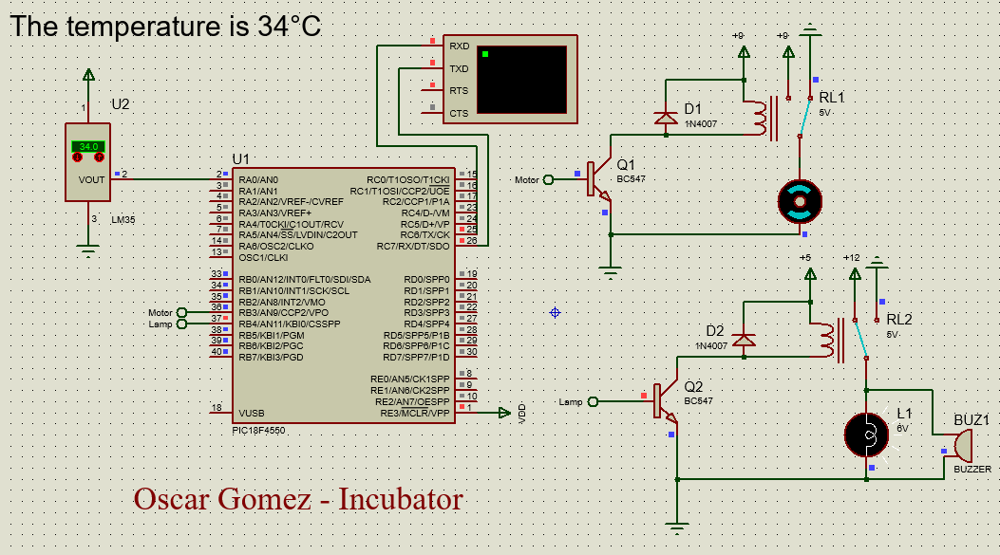

# Temperature-Regulation-Incubator-PIC18F4550
Simulation and control of an incubator's temperature using a PIC18F4550 microcontroller.

## Overview

This project simulates a basic temperature regulation system for an incubator using a **PIC18F4550** microcontroller. The goal is to maintain a stable temperature between **36°C** and **37.5°C**, similar to the environment required for newborn babies.

The system uses a **temperature sensor (LM35)** to monitor the incubator's temperature. Based on the sensor readings, the microcontroller activates either a **fan** (to cool down) or a **lamp** (to heat up) to keep the temperature within the desired range. The temperature data is also sent to a serial monitor so you can see the real-time status.

## How It Works

1. **Temperature Reading**: The sensor sends a voltage proportional to the temperature, which is converted to a digital value by the microcontroller.

2. **Temperature Control**: 
   - If the temperature **drops below 36°C**, the system turns on the lamp to warm up the incubator.
   - If the temperature **rises above 37.5°C**, the fan is activated to cool it down.
   - If the temperature is within the **36°C to 37.5°C range**, both the lamp and fan remain off.

3. **Real-Time Monitoring**: The temperature readings are sent to a serial monitor so you can keep track of the incubator.

Here is an animation showing how the simulation works:

*Figure 1: Simulation of the temperature regulation system*

## Tools & Technologies Used

- **Proteus**: For simulating the electronic circuit.
- **MPLab**: For writing and compiling the microcontroller code.
- **PIC18F4550**: The microcontroller that processes the temperature readings and controls the fan and lamp.
- **LM35 Temperature Sensor**: Provides the temperature readings to the microcontroller.
- **Serial Monitor**: Displays real-time temperature data.

